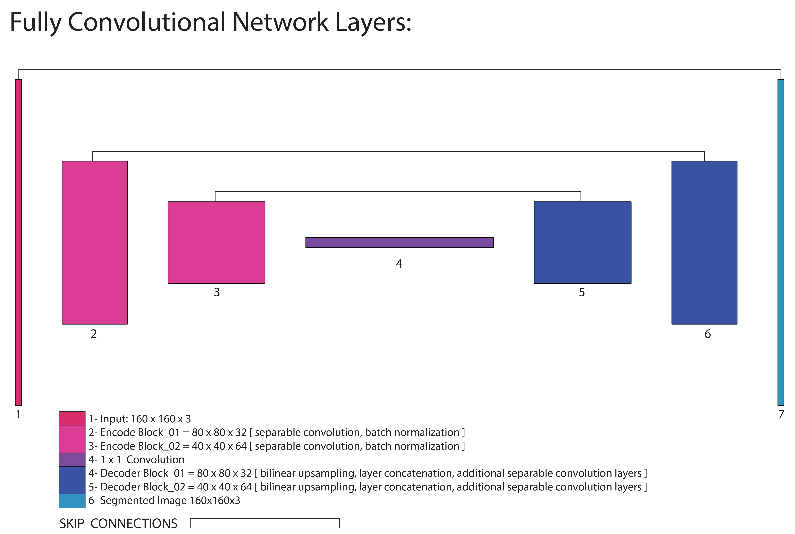
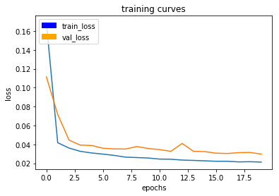

## Follow Me 

In this project we train a Fully Convolutional Network (FCN) to be able to identify a target in a simulated drone environment. A FCN is similar to a Convolutional Neural Network (CNN) but adds Skip Connections and the encode/decode step.

## The Main Libraries  

TensorFlow: is an open source deep learning library for numerical computation using data flow graphs. 

Keras: is a high level deep learning API that allows you to focus on network architecture rather than on smaller details building up to the network. Keras has recently been included in the TensorFlow library. 

## The Data Set 

01- Training data 

	train.zip: training set images: 4131 RGB images
	masks: 4131 mask images Target: Blue; Pedestrian: Green; Background: Red

02- Validation data
 
	validation.zip: validation set images: 1184 RGB images
	masks: 1184 mask images

	avoids overfitting

03- Test Images 

	following_images: 542 RGB images
	masks: 542 mask images

04- data/weights directory for running on simulation:

	2 files:

	1- configuration_weights file.h5 
	2- model_weights.h5

##  Network Architecture : Fully Convolutional neural network (FCN)

A Fully Convolutional neural network (FCN) is a normal CNN, where the last fully connected layer is substituted by another 1x1 convolution layer and upsampled for scene segmentation. 

The idea here is to capture the global context of the scene and enable us to tell what are the objects and their approximate locations in the scene. The output will be scene segmentation 

The structure of FCN is divided into three parts 

	(convolution or encoder) part which will extract features from the image 
	
	A 1x1 convolution simply maps an input pixel with all it's channels to an output pixel, not looking at anything around 
	itself. 
	Used to reduce the number of depth channels, since it is often very slow to multiply volumes with 
	extremely large depths.
	
	(transposed convolution, deconvolution or decoder) part which will upscale the output of the encoder

Convert our last fully connected (FC) layer of the CNN to a 1x1 convolutional layer

We choose our new conv layer to be big enough so that it will enable us to have this localization effect 
scaled up to our original input image size then activate pixels to indicate objects and their approximate locations.

Replacement of fully-connected layers with convolutional layers presents an added advantage that during testing, you can feed images of any size into your trained network.

#### problem and solution

We lose some information every time we do convolution through encoding or down-sampling.

This is because we keep the smaller picture and lose the bigger picture. 

To solve this problem we also get some activation from previous layers known as skip connections and sum them together with the 
upsampled outputs when decoding from the previous layer to avoid loss in information

#### Benefits of using FCN ?

Traditional convolutional networks have fully connected layers and cannot manage different input sizes 

Fully convolutional networks can have only convolutional layers or layers which can manage different input sizes and are faster at that task because output depends only on the local area of input.

Input can be of arbitrary size and produce correspondingly-sized output with efficient inference and learning.

#### FCN is consisting of the following components:

Encoder blocks: 

Decoder blocks: that will take inputs from previous layers, decompress it, by up-sampling and adding inputs from previous encoder blocks through skip connections to recover some of the lost information hence do the precise segmentation.

Softmax activation: normal convolution layer takes outputs from last decoder block and activate output pixels to indicate class and location of objects (semantic segmentation).

### Build the Model

You need to provide more detail here - why is having more spatial information useful in the decoding layer? What happens to the encoded image that would justify having these skip connections?

1- Encoder block: that will take inputs from previous layers, compress it down to a context.

	a- separable convolutions
	b- batch normalization
	c- Encoder Block Process/Code
	
2- 1x1 Convolution block: that will reduce depth and capture the global context of the scene.

	1x1 convolution

3- Decoder block: that will take inputs from previous layers, decompress it, by up-sampling and adding inputs from previous encoder blocks through skip connections to recover some of the lost information.

  	a- bilinear upsampling
	b- layer concatenation
	c- additional separable convolution layers
	d- Decoder Block Process/Code
	
4- Softmax activation: normal convolution layer takes outputs from last decoder block and activate output pixels to indicate class and location of objects.

5- Fully Convolutional Network Code 

	a- encoder block(s) - 1x1 convolution - decoder blocks(s)

#### 1- Encoder Block

#### a- Separable Convolutions

-convolution performed over each channel, different than regular convolutions bc reduction in the number of parameters which improves runtime performance, and reducing overfitting because fewer parameters

-Coding Seperable Convolutions:An optimized version of separable convolutions = provided in the utils module of the provided repo. 
implemented the function as follows:

	output = SeparableConv2DKeras(filters, kernel_size, strides, padding, activation)(input)
				

	input = input layer,
	filters = number of output filters (the depth),
	kernel_size = number that specifies the (width, height) of the kernel,
	padding =  "same" or "valid"
	activation = activation function [ ex. “relu” ]

#### b- Batch Normalization

-instead of just normalizing the inputs to the network ----> normalize the inputs to layers within the network by using the mean and variance of the values in the current mini-batch.
	
-Benefits of Batch Normalization: Networks train faster, Allows higher learning rates, Simplifies the creation of deeper networks, and adds a bit of regularization

-Coding Batch Normalization: In tf.contrib.keras, batch normalization can be implemented with the following function definition:

	from tensorflow.contrib.keras.python.keras import layers

	output = layers.BatchNormalization()(input) 

#### c- Encoder Block Process/Code

-Create an encoder block that includes a separable convolution layer using the separable_conv2d_batchnorm() function.

-separable_conv2d_batchnorm() function adds a batch normalization layer after the separable convolution layer
 
-The filters parameter defines the size or depth of the output layer = 32 or 64. 

	def encoder_block(input_layer, filters, strides):
    
   		# TODO Create a separable convolution layer using the separable_conv2d_batchnorm() function.
    		output_layer = separable_conv2d_batchnorm(input_layer, filters, strides)
    		return output_layer

### 2- 1x1 Convolution block: that will reduce depth and capture the global context of the scene.

Reduce the number of depth channels because it is very slow to multiply volumes with extremely large depths.

Replace fully-connected layers with convolutional layers presents an added advantage that during 
testing your model and you can feed images of any size into your trained network.

### 3- Decoder Block

#### a- bilinear upsampling

-Bilinear upsampling is a resampling technique that utilizes the weighted average of four nearest 
known pixels, located diagonally to a given pixel.

-The weighted average is usually distance dependent

-Coding Bilinear Upsampler: An optimized version of a bilinear upsampler has been provided --->  utils module of the provided repo 
implemented the function as follows:

	output = BilinearUpSampling2D(row, col)(input)

	input = input layer,
	row = upsampling factor for the rows of the output layer
	col = upsampling factor for the columns of the output layer
	output = output layer.

#### b- Layer Concatenation step. 

-Concatenating two layers, the upsampled layer and a layer with more spatial information than the upsampled one, 
presents us with the same functionality. 

implemented as follows:

	from tensorflow.contrib.keras.python.keras import layers
	output = layers.concatenate(inputs)

	inputs = list of the layers that you are concatenating.
	output = layers.concatenate([input_layer_1, input_layer_2])	

#### c- Some (one or two) additional separable convolution layers to extract some more spatial information from prior layers.

#### d- Decoder Block Process/Code

	def decoder_block(small_ip_layer, large_ip_layer, filters):

	    # TODO Upsample the small input layer using the bilinear_upsample() function.
	    upsampled_layer = bilinear_upsample(small_ip_layer)

	    # TODO Concatenate the upsampled and large input layers using layers.concatenate
	    output_layer = layers.concatenate([upsampled_layer, large_ip_layer])

	    # TODO Add some number of separable convolution layers
	    output_layer = separable_conv2d_batchnorm(output_layer, filters)
	    return output_layer
	    
### 4- Softmax activation: 

-normal convolution layer 
	
-takes outputs from last decoder block to indicate class and location of objects.

	return layers.Conv2D(num_classes, 1, activation='softmax', padding='same')(x)
    
### 5- Fully Convolutional Network used for identification:

I created 2 encoder/decoder levels because I was able to tweak the network paymasters enough to achieve a high enough final score. The FCN model used for the project contains two encoder block layers, a 1x1 convolution layer, two decoder block layers, and filter depths between 32 and 64.

	1.  Instead of fully connected layers We use 1x1 convolution layer

	2. Up-sampling is done by using bi-linear up-sampling,which help in up sampling the previous layer
	to a desired resolution or dimension and help speed up performance. 

	3.Skip connections, which allows to use information from multiple resolution scales from the encoder
	to decoder process

#### Encoder block layers

1st convolution encoder layer

	filter size = 32  
	stride = 2 
	padding = 'same'
 
2nd convolution  encoder layer

	filter size = 64  
	stride = 2 
	padding = 'same' 

	The padding and the stride of 2 cause each layer to halve the image size, while increasing the 
	depth to match the filter size used

#### 1x1 convolution block layer

a 1x1 convolution is verses a fully connected layer and when you would use one over the other.

	filter size = 128, with the standard kernel and 
	stride = 1.

#### Decoder block layers

First decoder block layer

	small input layer = output from the 1x1 convolution as the 
	large input layer = the first convolution layer,  mimicking a skip connection
	filter size  =  64
 
Second decoder block layer

	small input layer = output from the first decoder block  
	large input layer = original image  mimicking a skip connection better  
	filter size = 32.
	
	The output convolution layer applies a softmax activation function to the output of the second decoder block.

#### Fully Convolutional Network code here: 

	def fcn_model(inputs, num_classes):
    
    		# TODO Add Encoder Blocks.  
    		output_layer = encoder_block(inputs, filters = 32, 2)
    		ol_2 = encoder_block(output_layer, filters = 64, 2)
    
   		# TODO Add 1x1 Convolution layer using conv2d_batchnorm().
    		small_ip_layer = conv2d_batchnorm(ol_2, 128, kernel_size=1, strides=1)
    
    		# TODO: Add the same number of Decoder Blocks as the number of Encoder Blocks
    		x_almost = decoder_block(small_ip_layer, output_layer, filters = 64)
    		x = decoder_block(x_almost, inputs ,filters = 32)
    
    		# The function returns the output layer of your model. "x" is the final layer obtained from the last                                     decoder_block()
		return layers.Conv2D(num_classes, 1, activation='softmax', padding='same')(x)

FCN image:

## Hyperparameters [ Tuning for Performance ]

  batch_size: number of training samples/images that get propagated through the network in a single pass.

  num_epochs: number of times the entire training dataset gets propagated through the network.

  steps_per_epoch: number of batches of training images that go through the network in 1 epoch.

  validation_steps: number of batches of validation images that go through the network in 1 epoch. 
 
  workers: maximum number of processes to spin up.  

Test_01 

	learning_rate = 0.004
	batch_size = 32
	num_epochs = 35
	steps_per_epoch = 100
	validation_steps = 100
	workers = 32

	Time =  62s
	Final Score = 0.392293308138

Test_02 
 
	learning_rate = 0.004
	batch_size = 64
	num_epochs = 35
	steps_per_epoch = 175
	validation_steps = 175
	workers = 32

	Time = 86s 
	Final Score = 0.39924187389526666

Test_03 

	learning_rate = 0.004
	batch_size = 128
	num_epochs = 20
	steps_per_epoch = 250
	validation_steps = 100
	workers = 32

	Time = 424s 
	Final Score = 0.4012908844139478

## Final Score 

Measure the model's performance: IOU (intersection over union)

	metric is used which takes the intersection of the prediction pixels and ground truth pixels 
	and divides it by the union of them.
		
	
	Time = 424s 
	Final Score = 0.4012908844139478
	

	

Training GPU:

	classroom workspace provided by Udacity on Jupyter Notebooks

Target hero:  

	wearing red cloths 
	where once trained it will be able to identify the hero from common people 
	

## Final Comments:

This could be used for training on other things other than the specified target. The fully convolutional network would work on other humans, animals, particular cars, vegetation, and other elements that would be part of identification. The training would need to be deployed in a manner to handle other information besides the target object leaving it on our responsibility to train, validate, and test on before running the simulation on another object...

## Future Enhancements:

Record a bigger dataset to further improving the network accuracy.

Change in learning rate can also be helpful in reducing learning time.

Adding skip connections can improve results but up to a certain number of connections based on what we generated.

Adding more encoder-decoder layers to improve accuracy of segmentation.

